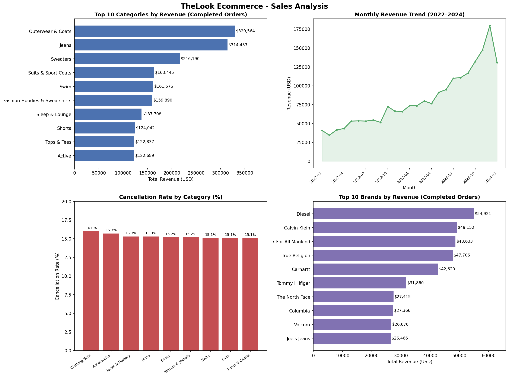
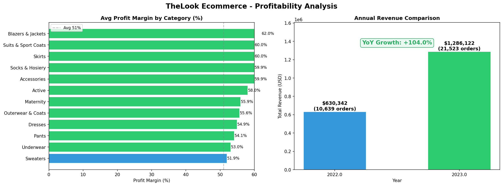
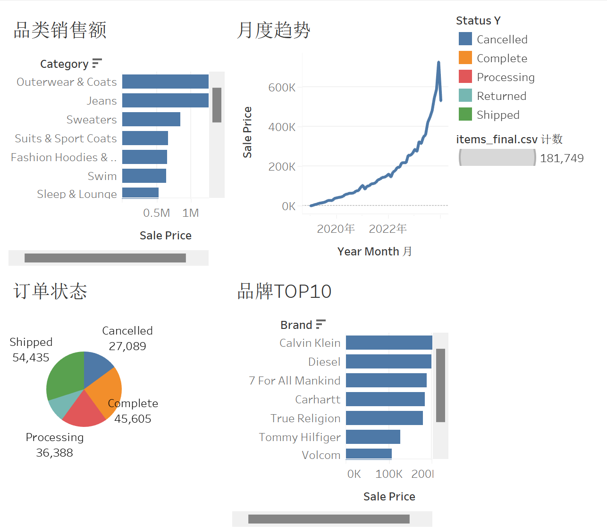

# TheLook Ecommerce 销售数据分析

## 项目简介
基于 TheLook Ecommerce 平台 2022–2023 年真实交易数据，
从品类、品牌、毛利率和订单健康度四个维度进行销售分析，
使用 Python、SQL 和数据可视化工具提炼核心业务结论。

## 核心发现
- 📈 2022→2023 年销售额增长 **104%**，从 $630K 翻倍至 $1.29M
- 💰 Blazers & Jackets 毛利率最高达 **62%**，比均值高出 11 个百分点
- ⚠️ 约 **25%** 的订单未能完成（取消 14.9% + 退货 10%），存在明显收入损耗

## 技术栈
- Python（Pandas）：数据清洗、字段处理、多表合并
- SQLite + SQL：6 条聚合查询，涵盖品类、品牌、趋势分析
- Matplotlib / Seaborn：生成 6 张可视化图表

## 数据来源
[TheLook Ecommerce - Kaggle](https://www.kaggle.com/datasets/mustafakeser4/looker-ecommerce-bigquery-dataset)
数据规模：181,749 条订单明细，23 个分析字段

## 图表预览

